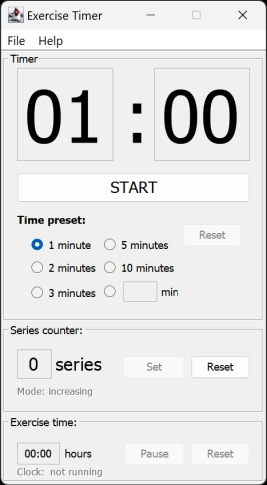

# Exercise-Timer

Simple Java GUI application that works as an exercise timer in home gym. With Exercise-Timer you can easily measure the time between workout series, track number of series and overall workout time.



I originally created this app way back during my studies when I was working out at home to track number of workout series and the rest time in between.

## Requirements

Exercise-Timer supports Java 8 versions and newer. If you are using higher DPI setting (e.g. on 4K screen), use Java 11 and newer.

## How to run

To run Jar file

```cmd
java -jar Exercise-Timer.jar
```

To run directly from source 

```cmd
java src/MainApplication.java
```

## Licence

GNU General Public License v3.0
